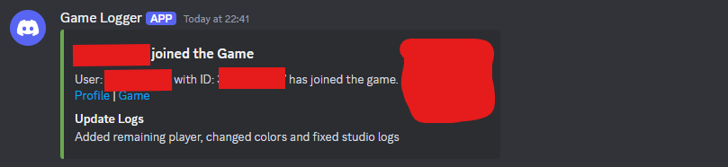
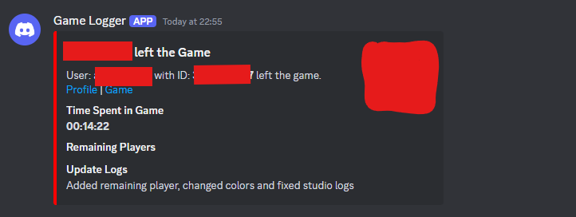

# Logging system for your Roblox game

This is a logger for your Roblox game

## what does it log?

- Username
- Time spent in server
- Remaining Players

## Example for the Logger

## Other information about the logger

- Won't log in Studios
- There is free space for Update Logs
- Don't use an extended api for the discord-webhook

## how to

- make a discord webhook
- open roblox studios
- make a roblox game
- open a Script and move it to ServerScriptService
- copy code and paste webhook link in line 4
- publish your game and have fun!

## Note

Do not Share your webhook link with anyone

Everyone can use this code, see license

By changing anything on the discord channel forces you to make a new Webhook link

## Make the Logger better

Please modify the Logger and make it to a better one!

## Get in Contact with me

Discord: reformslayz (It might take me a while to reply)